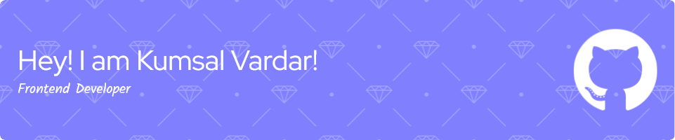

  <ul align="center" style="list-style: none">
    

      <h1>
        👋 Hi, my name is Kumsal Vardar
      </h1>
    

  </ul>

**<h3 align="left">Connect with me:</h3>** 

 **<h3 align="left">🚀 Passionate frontend web developer, creating robust and scalable web applications. Skilled in front-end technologies, with a keen eye for user experience and performance optimization.</h3>**

**<h3 align="left">Rapid Fire</h3>**

- 💼 I'm currently working on: **💻 Developing a personal portfolio**
- 🌱 I'm currently learning: **📚 Exploring Golang**
- 💬 Ask me about: **💡 JavaScript, React, Node.js, TypeScript, and RESTful APIs**
- ⚡ Fun fact: **🎢 I once debugged a issue while on a roller coaster!**

 **<h3 align="left">Skills</h3>**

           

